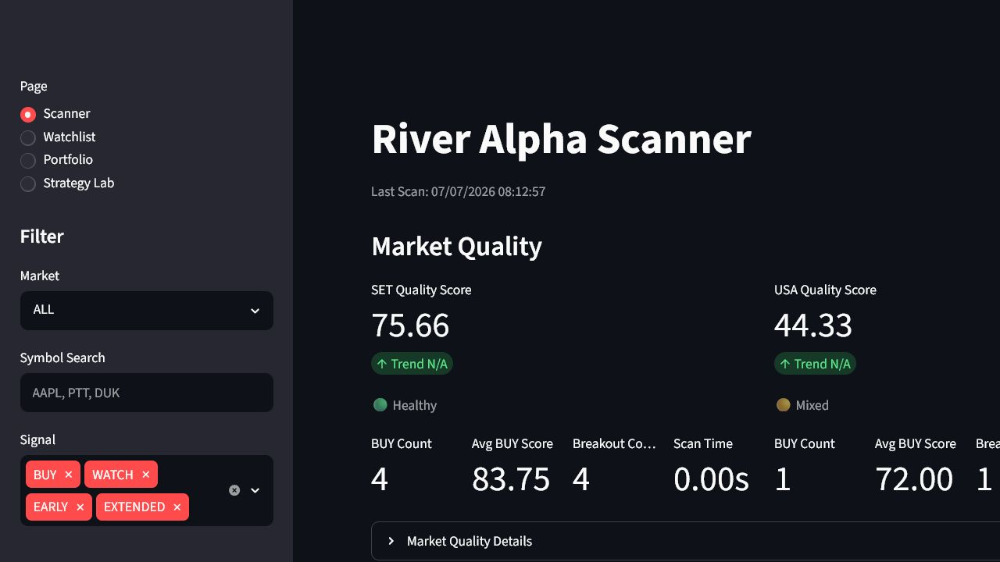

# River Alpha Scanner

River Alpha Scanner is a local stock research platform for finding high-quality trading setups across SET and US markets. It combines market data, indicators, modular strategy engines, portfolio tracking, watchlists, alerts, and a Strategy Lab for backtesting ideas.

This project is designed as a decision-support tool, not an automated trading bot or financial advice.

## Release Status

- Version: River Alpha v2.3
- Status: Dashboard UI Frozen
- Future Scanner UI changes: bug fixes only

## Features

- Scanner for SET, US100, S&P 500, and Dow 30 watchlists
- Modular decision architecture: Trend, Momentum, Volume, Base, Breakout, Price, Stage, Quality Gate, and Signal Engine
- Market Quality Score for SET and USA after each scan
- Streamlit dashboard with filters, market summary, top SET/USA candidates, and scanner results
- Seed-focused Dashboard with AI Pick Today, Top 5 SET/USA Seed cards, Buy Queue, and Market Quality recommendations
- Watchlist workflow with notes, status, stop loss, target, and alerts
- Portfolio Manager with SET/USA fee support and THB summary
- Strategy Lab with backtest trades, equity curve, monthly returns, benchmark comparison, and run history
- CSV/XLSX outputs for dashboard compatibility

## Screenshot



## Installation

```powershell
git clone https://github.com/abidin676/AI-Stock-Scanner.git
cd AI-Stock-Scanner

python -m venv venv
.\venv\Scripts\activate

pip install -r requirements.txt
```

## Usage

Run the scanner first:

```powershell
python scanner.py
```

Start the dashboard:

```powershell
python -m streamlit run dashboard.py
```

Benchmark scanner performance:

```powershell
python tools/benchmark_scanner.py --workers 8
```

Then open:

```text
http://localhost:8501
```

## Main Outputs

- `output/scanner_results.csv`
- `output/scanner_results.xlsx`
- `output/market_quality.csv`
- `data/watchlist.csv`
- `data/portfolio.csv`
- `data/strategy_history.csv`
- `output/strategy_lab_trades.csv`
- `output/strategy_lab_summary.csv`
- `output/strategy_lab_equity.csv`
- `output/strategy_lab_monthly.csv`
- `output/strategy_lab_benchmark.csv`

## Project Structure

```text
scanner.py
data.py
indicators.py
strategy.py
strategy_engine/
views/
dashboard.py
watchlist.py
portfolio.py
backtest_engine.py
strategy_history.py
market_quality.py
```

## Project Docs

- [About](ABOUT.md)
- [Changelog](CHANGELOG.md)
- [Roadmap](ROADMAP.md)
- [License](LICENSE)

## Notes

River Alpha runs locally and stores portfolio, watchlist, scanner, and Strategy Lab files on your machine. Review every signal manually before making any trading decision.
